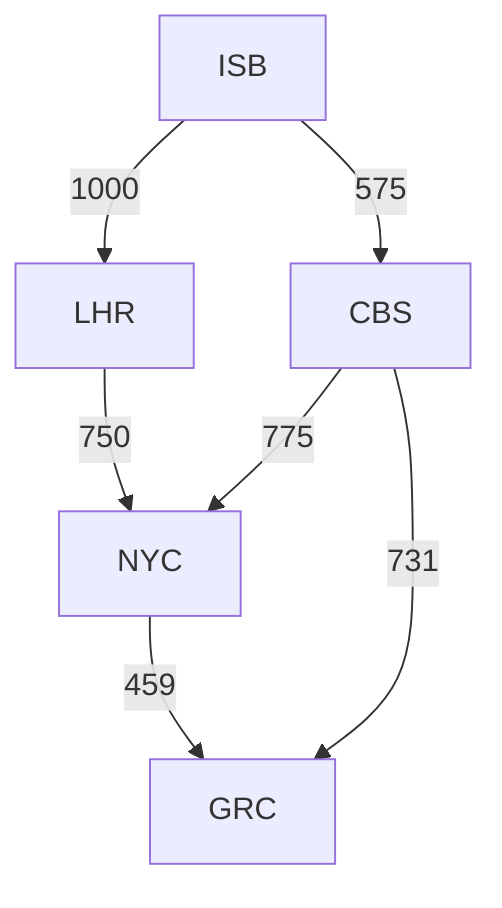

# Cheapest path problem

The problem is described in [Problem.md](/Problem.md).

## How to run

The solution is implemented in Python 3. The main file is [cheapest_path.py](/cheapest_path.py). To run the solution, execute the following command:

### Windows

Interactively fill out the airports

```powershell
python cheapest_path.py
```

OR

Provide airports as CLI arguments

```powershell
python cheapest_path.py <start_airport> <end_airport>
```

e.g., `python cheapest_path.py ISB NYC`

### Linux

Replace `python` with `python3` in the above commands.

## Approach

The problem is a classic example of graph traversal. The solution uses Dijkstra's algorithm (greedy algo) to find the cheapest path from the start airport to the end airport. The airports are retrieved from a local `.json` file. The graph is built using a python dictionary where the keys are the airports and the values are the connections from that airport. The connections are stored as a list of tuples, where each tuple contains the destination airport and the cost of the connection. The representation follows the adjacency list representation of a graph. Sample graph representation is as follows:

```python
{
    'ISB': [('LHR', 1000), ('CBS', 575)],
    'LHR': [('NYC', 750)],
    'CBS': [('NYC', 775), ('GRC', 731)],
    'NYC': [('GRC', 459)]
}
```



## Assumptions

- The solution assumes that airports are uni-directional. For example, if there is a connection from `ISB` to `LHR`, it does not assume that there is a connection from `LHR` to `ISB`. This is consistent with the fact that if a direct flight is available from `ISB` to `NYC`, it does not necessarily mean that a direct flight is available from `NYC` to `ISB` (airports tend to change routes based on various conditions).
- The cost of the connection is assumed to be **non-negative**. (Dijkstra's algorithm does not work with negative weights).

## Time and Space Complexity

Time complexity = O(V<sup>2</sup>) (worst case i.e., complete graph) or `O(E log V)` (sparse graph)

Space complexity = O(V + E)

The time complexity of the main algorithm involving Dijkstra's algorithm is `O(V<sup>2</sup>)` where `V` is the number of vertices in the graph or airports in this case. If the graph is sparse, i.e., the number of edges `E` is much less than `V<sup>2</sup>`, then the time complexity is `O(E log V)`.
The space complexity is `O(V + E)` to store the adjacency list representation of the graph, where `E` is the number of edges in the graph or in this case the number of connections between airports. A priority queue is used to store the vertices and their costs, which has a space complexity of `O(V)`. So, the overall space complexity is `O(V + E)`.
